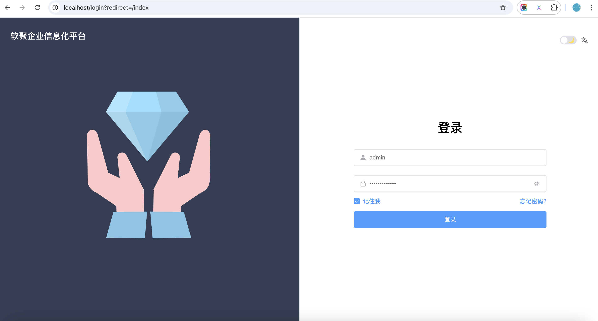

### 启动

* 克隆 https://github.com/starrystar-tech/elm-frontend.git 项目，并 Star 关注下该项目。

* 在目录下执行如下命令，进行启动：
```sh
# 安装 pnpm，提升依赖的安装速度
npm config set registry https://registry.npmmirror.com
npm install -g pnpm
# 安装依赖
pnpm install

# 启动服务
npm run dev

```
* 启动完成后，在浏览器中访问 http://localhost 即可, 如下图示例


