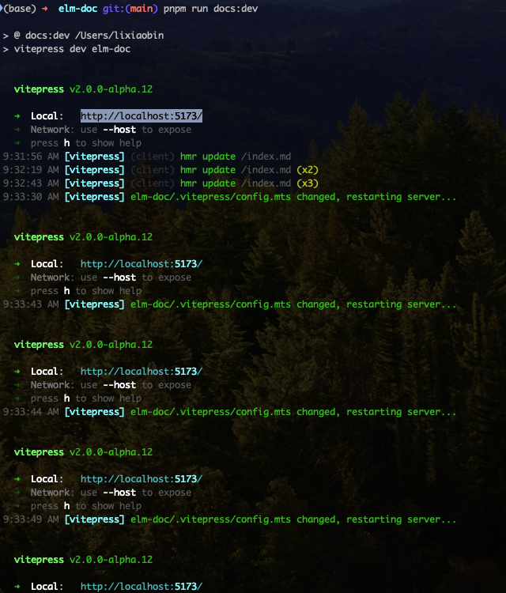
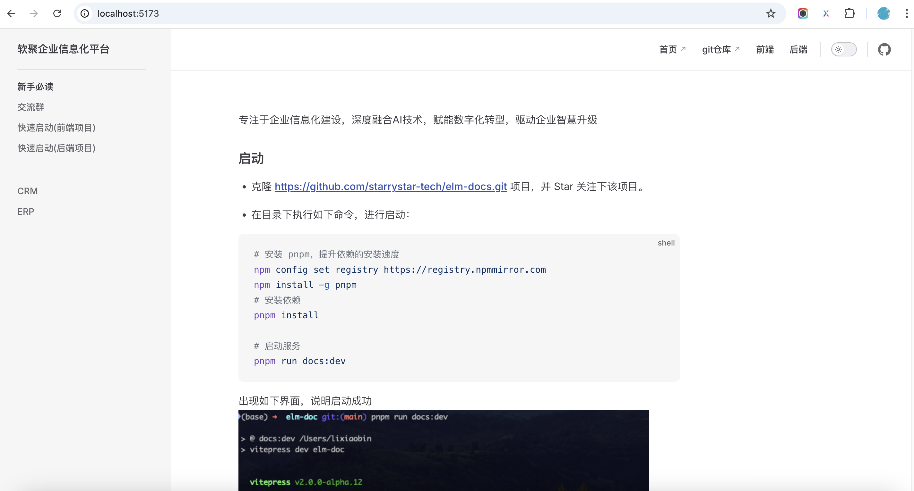

---
# https://vitepress.dev/reference/default-theme-home-page


---专注于企业信息化建设，深度融合AI技术，赋能数字化转型，驱动企业智慧升级
### 地址

体验地址 https://elm.softfocus.cn/ <br>
文档地址 https://docs.softfocus.cn//

### 技术栈
* [markdown](https://markdown.com.cn/)
* [vitepress](https://vitepress.dev/)


### git 仓库
| 平台 | 地址 |
| --- | --- |
| github | 前端项目 https://github.com/starrystar-tech/elm-frontend <br>后端项目 https://github.com/starrystar-tech/elm-backend <br>文档地址 https://github.com/starrystar-tech/elm-docs|
| gitee | 前端项目 https://gitee.com/starrystar-tech/elm-frontend <br>后端项目 https://gitee.com/starrystar-tech/elm-backend <br>文档地址 https://gitee.com/starrystar-tech/elm-docs|


### 启动
* 安装nodejs 安装18以上版本

* 克隆 https://github.com/starrystar-tech/elm-docs.git 项目，并 Star 关注下该项目。

* 在目录下执行如下命令，进行启动：

```shell
# 安装 pnpm，提升依赖的安装速度
npm config set registry https://registry.npmmirror.com
npm install -g pnpm
# 安装依赖
pnpm install

# 启动服务
pnpm run docs:dev
```
出现如下界面，说明启动成功


* 启动完成后，在浏览器中访问 http://localhost:5173 即可, 如下图示例
